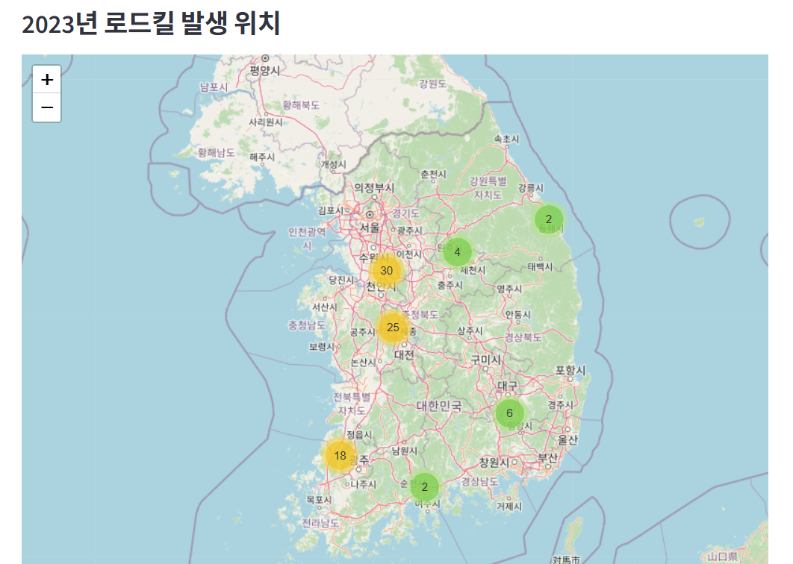
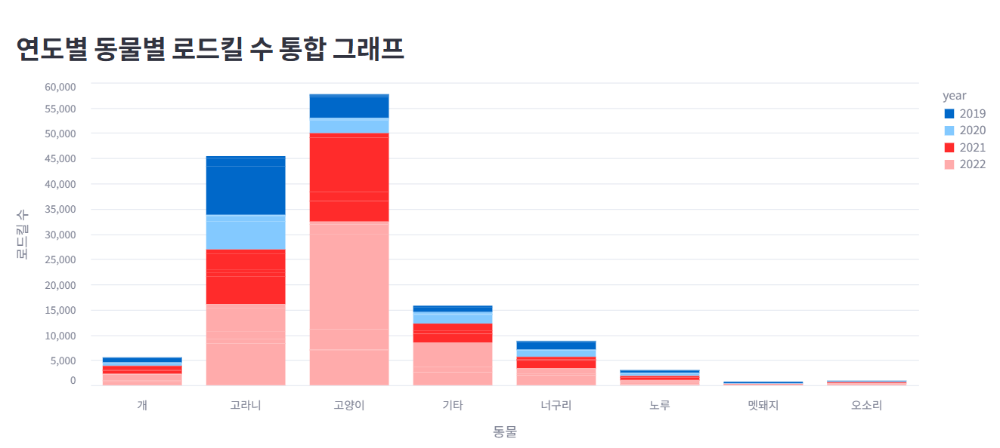
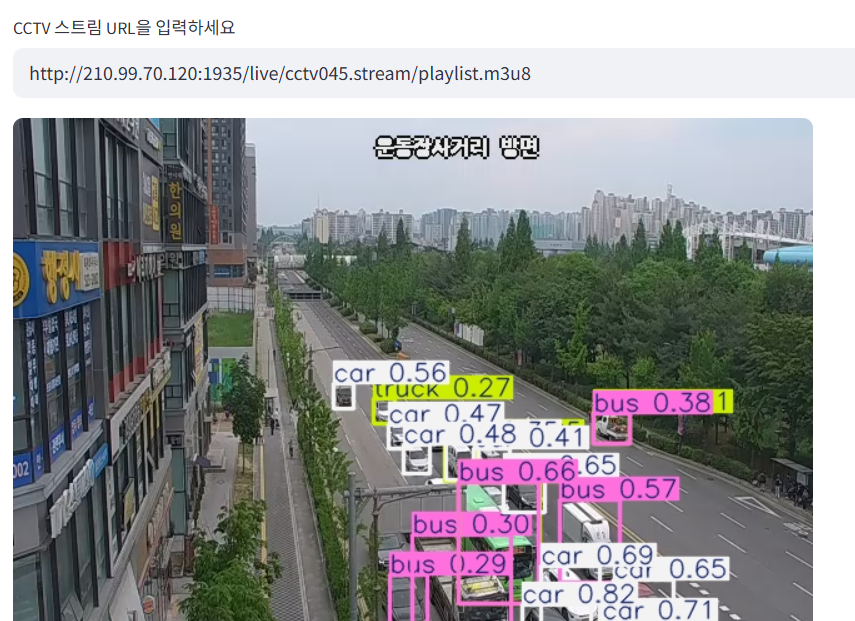

# 🦌 로드 가디언즈 : 로드킬 방지 시스템
# 🦌 Road Guardians : Roadkill Prevention System

로드킬 문제 개선을 위해 AI 객체인식모델 YOLO을 적용한 도로 위의 객체 요소 실시간 분석 시스템입니다. 
교통 객체, AI-hub 이미지를 기반으로 모델 클래스를 추가한 형태로 커스터마이징이 가능한 형태입니다. 
본 프로젝트에서 사용된 데이터는 국토교통부 공모전 서약 내용에 따라 활용되었습니다.

---
## 🏞 제안배경
- 매년 도로 위에서 발생하는 로드킬 사고는 운전자와 동물 모두에게 치명적인 피해를 유발하며 사회적 이슈로 부상
  - 특히 야간이나 시야가 제한된 도로에서 사고 발생률이 높음
  - 현재 국내에는 경고 표지판, 울타리 등 수동적 예방 장치가 일부 마련되어 있으나, 실시간 감지 및 능동적인 대응이 가능한 기술은 부족
- 일부 국가에서는 열화상 카메라와 AI를 활용한 로드킬 탐지 시스템이 시범 운영 중
- 이를 국내 실정에 맞춰 개선·도입한다면 과학적인 사고 예방이 가능할 것으로 예상되어 본 프로젝트를 개발 시작
---
## 📊 데이터 선정
- 자율주행차량 진행 방향 이미지(뒤쪽, 양쪽 방향 카메라)| 국가교통데이터오픈마켓
- 자율주행차량 진행 방향 이미지(두 번째, 세 번째 카메라) | 국가교통데이터오픈마켓
- 야생동물 활동 영상 데이터 | AI-Hub
- 한국도로공사_로드킬 데이터 정보
- 울산시설공단_야생동물 로드킬 모니터링 현황 | 공공데이터포털
- 국립공원공단_국립공원 로드킬 정보 | 공공데이터포털
- 국립공원공단_로드킬구간거리 | 공공데이터포털
- 국립공원공단_속리산로드킬 | 공공데이터포털
- 국립생태원_동물 찻길 사고 현황 자료 | 공공데이터포털
---
## 🌠 운영 흐름 및 기대효과
> 카메라, IoT 센서, 실시간 CCTV 영상 등의 도로 객체 인식  
> → YOLO 모델을 통한 실시간 객체 분석  
> → 동물 객체 탐지시, 운전자 음성 및 디스플레이를 통한 즉각 경고  
> → 운전자는 객체 인식을 바탕으로 안전운전 및 로드킬 방지에 기여  
> → 탐지 데이터는 서버에 저장  
> → 해당 도로 담당 공공기관의 관리자는 관리자 웹 시스템에서 대시보드 형태로 구축된 데이터 열람  
> → 사고 다발 구격에 대한 정책 수립, 시설 보강에 기여
---
## 🏙 프로토타입
<table>
  <tr>
    <td></td>
    <td></td>
    <td></td>
  </tr>
</table>

---
## 💬 문의 및 기여

- 작성자:
  [김우혁](https://github.com/toto6343),
  [김경서](https://github.com/kkyungseo),
  [손기훈](https://github.com/sonkeehoon)  
- 기여 및 문의: 해당 Repository의 자유로운 Issue 작성 가능
